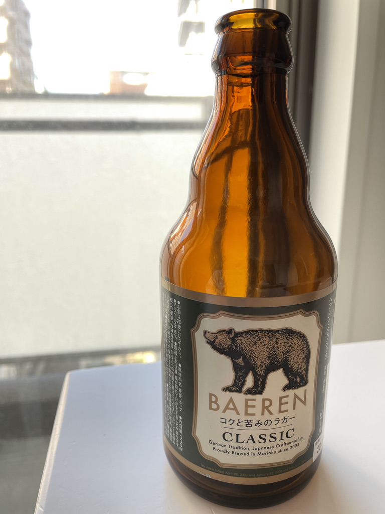

**2022/12/4追記：画像のリンクを修正、立ち上げ奮戦記のリンクを修正** 

COVID-19で外出自粛となり、お酒を飲むことがほとんどなくなった。 
2020年はここ数年でいちばん飲まなかった。居酒屋で夜通し飲んでいたのが遠い昔に感じる。 
この傾向は2021年も変わらないと思う。そうであるなら、少しお金をかけて美味しいものが飲みたい。 
こうしてクラフトビールの世界に足を踏み入れることになった。 

今回飲んだのは、ベアレンクラシック。 
岩手県盛岡市のクラフトビールらしい。 

ほどよい苦味と後味のさっぱりさのバランスが良いビールだった。 
これを買ったスーパーには、もう1種類あったので今度はそっちも飲んでみたい。 

どういったところが作っているのか調べていたら、インターネットの史料とも呼ぶべきサイトが残っていた。 
[ベアレン醸造所ブルワリー立ち上げ奮戦記](https://www.rakuten.ne.jp/gold/baeren/funsenki/) 
立ち上げ当時の記録を会社が残しているのだ。なかなか読めるものではないはずで、貴重なサイトだと思う。 
ゆっくり時間を見つけて読むことにする。それこそビールでも飲みながら。
