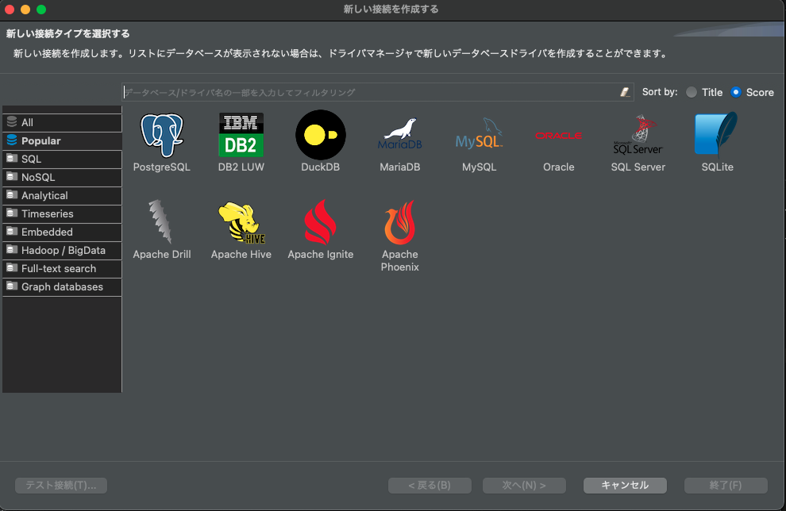
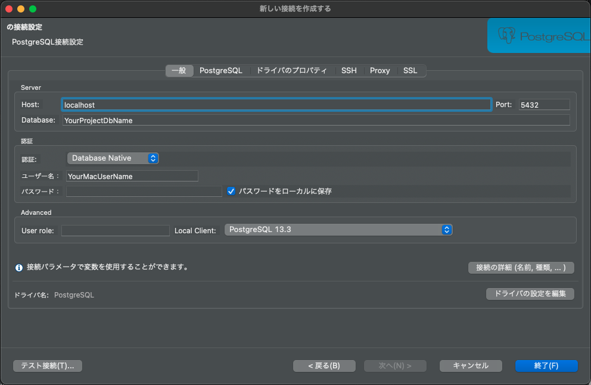
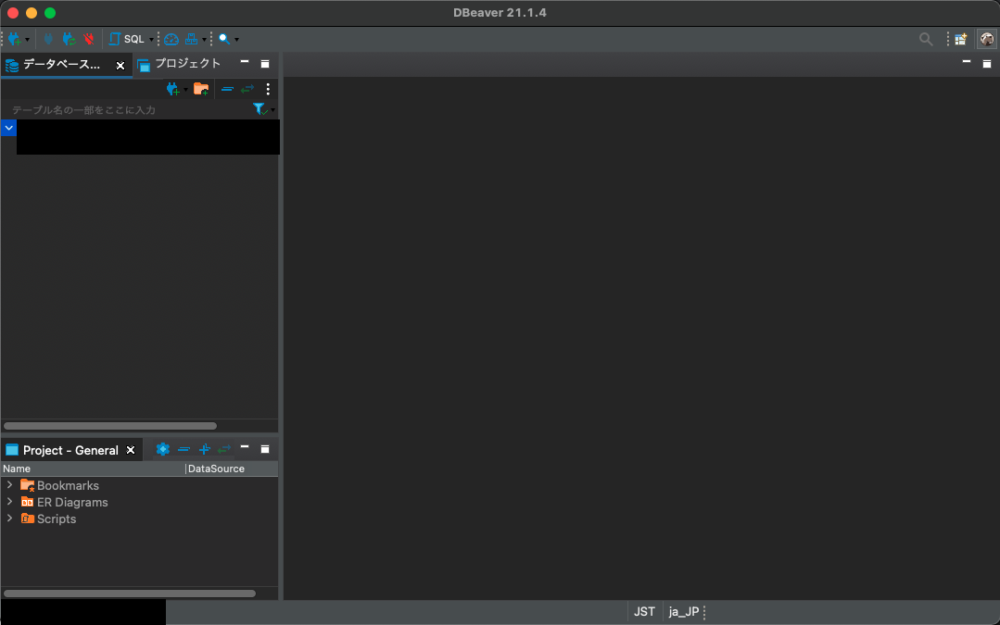

## はじめに

友人のRailsプロジェクトに参加させてもらえることになり、あれこれキャッチアップしているのだが、DBの状況がよくわからないという課題が出てきた。 
ActiveRecordなので、ターミナルでrails cすれば一発でテーブルを参照できる。 
が、永遠のRails初心者であること、仕事ではSQLクライアントでデータを確認しているため、慣れているやり方を使いたいなと思いよさげなSQLクライアントを探した。 
少し探すと、Macであれば[DBeaver](https://dbeaver.io/)の評判が良さそうだったので試してみた。 

## 手順

[DBeaver](https://dbeaver.io/)にアクセスし、Downloadをクリックする。 
個人で利用する範囲であれば、Community Editionで十分だと思う。Mac OS X(dmg)をクリックする。 
BrewやMacPorts経由でのインストールも紹介されているが、個人的にGUIをこれらで管理することに違和感があったため、dmgファイルにした。 
ダウンロードが始まるので完了するまで待つ。 
自動で新しい接続の設定画面が開くので、設定したいDBを選ぶ。 

今回はPostgreSQLだったので、アイコンをクリックする。 
接続設定画面が開くので、以下のように設定した。 

---

Host: localhost 
Database: Railsプロジェクトのconfig/database.yml内で定義されているdevelopmentのdatabaseを設定 
ユーザー名：PCのローカル環境に直接Railsプロジェクトをクローンしているため、PCのユーザー名を設定 
パスワード：未設定

---

接続が成功すると、左側にテーブルなどが表示されるカラムなどが用意されている操作画面に切り替わる。 

画面左上の[SQL]ボタンをクリックすると、SQLエディタが開くのでクエリを書きまくる。 

## 所感

簡単なクエリを投げただけだが、いつも使っているSQLクライアントとの操作感に大きな差はなく快適。 
これでCLIで頑張ることとdbフォルダ配下を覗きにいく必要がなくなり、キャッチアップが捗りそう。 

## 参考

[how to connect a postgresql with dbeaver (21.0.0)?](https://stackoverflow.com/questions/66515630/how-to-connect-a-postgresql-with-dbeaver-21-0-0)
