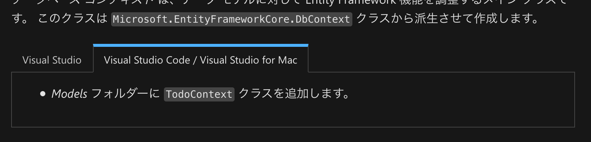
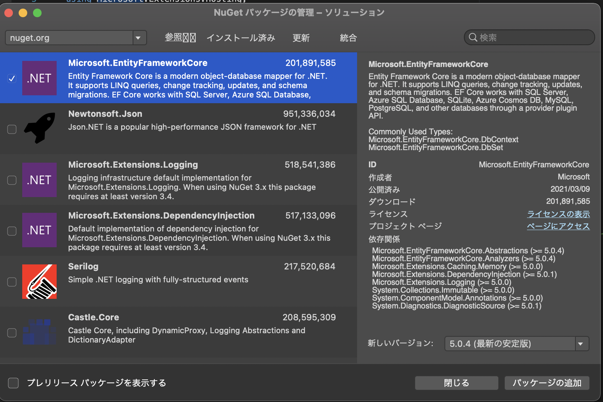

仕事でC#でAPIを書くことになるのでやってみました。</br>
[チュートリアル: ASP.NET Core で Web API を作成する](https://docs.microsoft.com/ja-jp/aspnet/core/tutorials/first-web-api?view=aspnetcore-3.1&tabs=visual-studio)

今回Visual Studio for Macを使って進めていたのですが、公式チュートリアルになぜか手順が載っていない箇所があり、ハマっていたので備忘で記載しておきます。</br>

## Microsoft.EntityFrameworkCore.InMemoryの追加

チュートリアルの見出しでいうと、[データベースコンテキストの追加](https://docs.microsoft.com/ja-jp/aspnet/core/tutorials/first-web-api?view=aspnetcore-3.1&tabs=visual-studio-code#add-a-database-context)のところです。</br>
Visual Studio CodeおよびVisual Studio for Macのタブを見ると、</br>
>Models フォルダーに TodoContext クラスを追加します。


とだけ書かれています。</br>
クラスを追加するだけなら別に問題はないのですが、その下に書かれているコードを見てみると</br>

```C#
using Microsoft.EntityFrameworkCore
```

と書かれており、そのまま続けようとしてもVisual Studioがこのusing句を認識できません（グレーアウトしたまま）。</br>
C#開発をやったことがあれば、「あーNuGetパッケージが足りないんだな」とわかると思います。</br>
ただ、僕はC#をざっと勉強しただけでこのチュートリアルを始めたので、何が原因なのかよくわかりませんでした。</br>
たまたま会社の人に聞いたところ、Microsoft.EntityFrameworkCore.InMemoryはで追加で入れないといけないと教えてもらい解決しました。</br>
Visual Studioのプロジェクト＞NuGetパッケージの管理を開き、Microsoft.EntityFrameworkCore.InMemoryを検索しインストールすればOK。</br>


無事インストールできると、グレーアウトしていた箇所がきちんと活性化します。</br>
今回のチュートリアルで、NuGetパッケージというものがあり、必要に応じて追加していくことがわかりました。</br>
（Rubyでいうところのgemと理解しました）</br>

最後に、このチュートリアルに対するフィードバックができたので、GitHubに[issue](https://github.com/dotnet/AspNetCore.Docs.ja-jp/issues/385)を立ててみました。</br>
修正されると嬉しいな。
